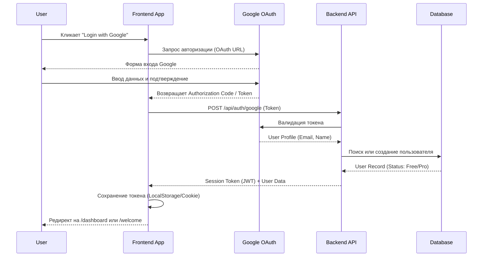
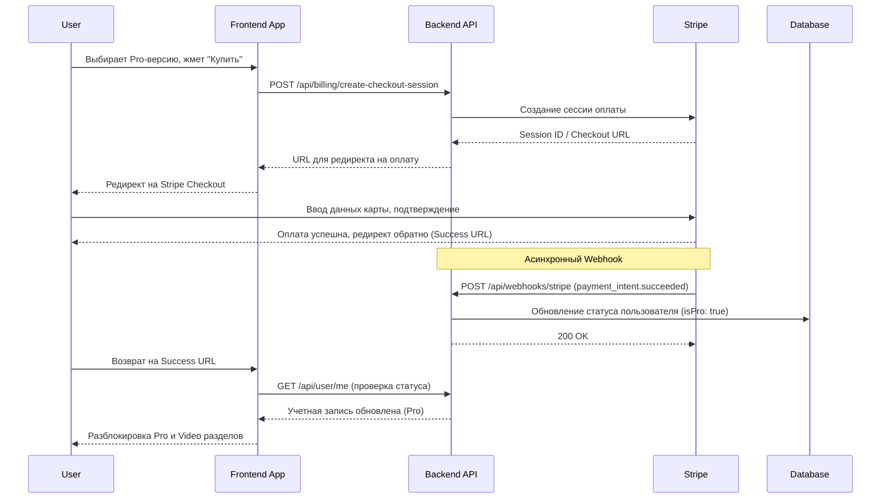
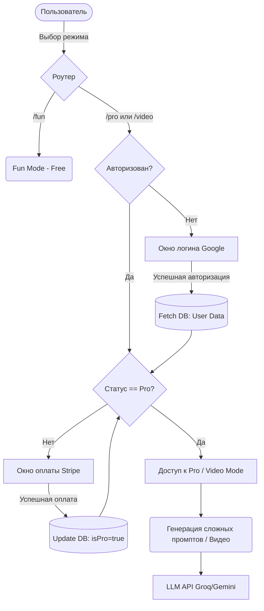

# Архитектурный дизайн: Внедрение новых фич в GravVPE

## 1. Структура по модели C4

Текущая архитектура представляет собой набор разрозненных HTML-файлов (Vanilla JS + HTML + CSS) с хардкоднутыми ключами и отсутствием централизованного управления состоянием или роутингом. Для внедрения авторизации, оплаты и безопасного разделения доступов предлагается переход на клиент-серверную архитектуру (например, React/Vite для Frontend и легковесный Node.js/Serverless для Backend).

### 1.1. Level 1: System Context Diagram
Показывает систему в целом и ее взаимодействие с внешними сервисами.
- **Пользователь (User)**: Взаимодействует с приложением через веб-интерфейс.
- **GravVPE Web App**: Основная система генерации промптов для изображений и видео.
- **Внешние системы**:
  - **Google OAuth**: Сервис аутентификации пользователя.
  - **Stripe / API Платежей**: Обработка платежей и управление подписками.
  - **LLM APIs (Groq, Gemini)**: Генерация и оптимизация промптов.
  - **n8n Webhook**: Интеграция с внешними пайплайнами пользователя.

### 1.2. Level 2: Container Diagram
Показывает основные контейнеры системы.
- **Frontend SPA (React/Vue или модульный Vanilla TS/JS + Router)**:
  - Обрабатывает UI/UX пользователя. Хранит глобальное состояние (Auth, Payment, Prompt Config).
  - Включает роутинг: `/` (Welcome), `/fun`, `/pro`, `/video`.
- **Backend API (Node.js/Express или Serverless/Next.js API Routes)**:
  - *BFF (Backend-for-Frontend)*: Скрывает логику работы с ключами сторонних API (Groq, Gemini).
  - Обрабатывает Google Auth токены, валидирует сессии.
  - Принимает Stripe Webhooks для изменения статуса пользователя (Free -> Pro).

### 1.3. Level 3: Component Diagram (Frontend SPA)
Разбивка Frontend контейнера на компоненты.
- **Contexts / Providers**:
  - `AuthProvider`: Управляет токеном Google, сессией и профилем пользователя.
  - `BillingProvider`: Управляет статусом подписки (исходя из профиля).
  - `PromptStateProvider`: Хранит текущие параметры генерации.
- **Containers (Страницы)**:
  - `WelcomeContainer`: Landing страница с выбором пути (Fun / Pro).
  - `FunModeContainer`: Упрощенный генератор (бесплатный доступ).
  - `ProModeContainer`: Продвинутый генератор промптов (требует Pro).
  - `VideoPromptContainer`: Генерация видео-промптов (требует Pro).
- **Components**:
  - `GoogleLoginButton`, `PaywallModal`, `FeatureGate` (HOC для блокировки UI).
  - Общие компоненты UI: `Card`, `NeonButton`, `Slider`, `Range` (на основе UI референсов).

---

## 2. Sequence-диаграммы (Mermaid)

### 2.1. Флоу авторизации (Google Auth)

### 2.2. Флоу оплаты (Stripe)

---

## 3. Data Flow Diagram (DFD)

Как данные пользователя и статус оплаты влияют на доступ:

---

## 4. Контракты API и Стратегия тестирования

### 4.1. Контракты API (RESTful)

**1. Аутентификация**
- `POST /api/auth/google`
  - **Request**: `{ "token": "google_jwt_token_here" }`
  - **Response (200)**: `{ "jwt": "app_session_token", "user": { "id": "1", "email": "a@a.com", "isPro": false } }`

**2. Платежи и Подписки**
- `POST /api/billing/checkout`
  - **Request**: `{ "planId": "pro_monthly" }`
  - **Response (200)**: `{ "checkoutUrl": "https://checkout.stripe.com/..." }`
- `POST /api/webhooks/stripe`
  - **Request**: Stripe Webhook Event Payload
  - **Response (200)**: Статус обработки (OK/Fail)

**3. Пользователь**
- `GET /api/user/me`
  - **Headers**: `Authorization: Bearer <jwt>`
  - **Response (200)**: `{ "id": "1", "isPro": true, "email": "a@a.com" }`

### 4.2. Стратегия тестирования

**1. Unit-тесты (Логика и UI Компоненты)**
- Проверка HOC-компонента `FeatureGate`:
  - КЕЙС 1: Если `isPro === false`, скрывать контент внутри `FeatureGate` и рендерить заглушку (Paywall).
  - КЕЙС 2: Если `isPro === true`, рендерить `children` компонент.
- Тесты рутера: переход неавторизованного пользователя по прямой ссылке `/pro` должен редиректить на `/welcome` или показывать Auth Modal.

**2. Интеграционные тесты (API)**
- Защита эндпоинтов генерации (если LLM запросы проксируются через Backend):
  - КЕЙС: Вызов `/api/generate/pro` без `Authorization` хедера -> Ожидается `401 Unauthorized`.
  - КЕЙС: Вызов `/api/generate/pro` с токеном пользователя `isPro: false` -> Ожидается `403 Forbidden`.
  - КЕЙС: Вызов `/api/generate/pro` с токеном `isPro: true` -> Ожидается успешный прокси-запрос к Groq/Gemini.

**3. E2E Тесты (Флоу оплат - Stripe Test Mode)**
- **Кейс оплаты (Успешный)**: Навигация на `/pro` -> Клик по заблокированному элементу -> Переход на Stripe Checkout -> Ввод тестовой карты (4242...) -> Редирект обратно -> Убедиться, что интерфейс Pro раздела разблокирован.
- **Webhook тестирование**: Отправка мокового webhook события `payment_intent.succeeded` в API, затем проверка `GET /api/user/me` для подтверждения обновления флага `isPro`.
- **Кейс отказа от оплаты**: Нажатие кнопки "Назад" в Stripe Checkout -> Редирект на cancel_url -> Убедиться, что доступ к Pro все еще закрыт.
